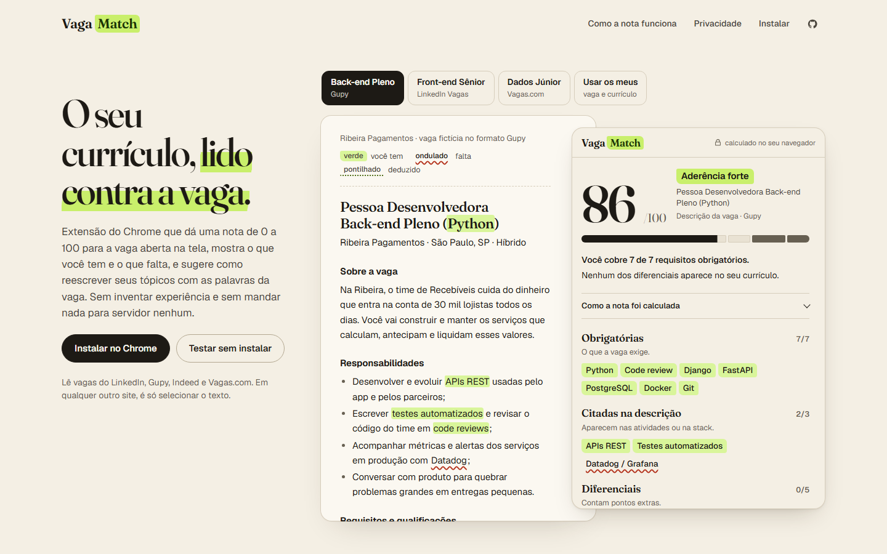
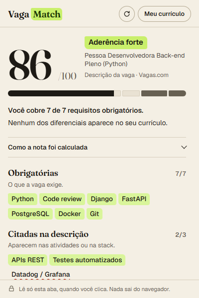

# Vaga Match

**O seu currículo, lido contra a vaga.** Extensão do Chrome que dá uma nota de 0 a 100 para a vaga aberta na tela, mostra o que você tem e o que falta, e sugere como reescrever seus tópicos com as palavras da vaga. Tudo roda no navegador: nada é enviado para servidor nenhum.

[](https://leandromlmoreira.github.io/vaga-match/)

**[Ver ao vivo](https://leandromlmoreira.github.io/vaga-match/)** · **[Baixar a extensão (.zip)](https://github.com/leandromlmoreira/vaga-match/releases/latest/download/vaga-match.zip)**

## Como funciona

1. Você envia o currículo uma vez, em PDF ou texto. O PDF é lido no próprio navegador com o pdf.js e o texto fica em `chrome.storage.local`.
2. Numa página de vaga (LinkedIn Vagas, Gupy, Indeed, Vagas.com), você clica no ícone. Em qualquer outro site, selecione o texto da vaga antes de clicar.
3. O popup mostra:
   - nota de 0 a 100 com a conta aberta;
   - habilidades obrigatórias, citadas na descrição e diferenciais, em verde (você tem), ondulado vermelho (falta) ou pontilhado (deduzido, como SQL a partir de PostgreSQL);
   - senioridade pedida e a sua, modelo de trabalho, contrato, faixa salarial e inglês;
   - sugestões de reescrita: trocar o termo pelo que a vaga usa, mostrar em qual experiência você usou uma ferramenta que só está na lista, colocar número num tópico. Nenhuma sugestão acrescenta uma habilidade que o seu currículo não tenha.



### A nota

| Parte | Pontos | Como conta |
| --- | --- | --- |
| Habilidades pedidas | 65 | Obrigatória pesa 3, citada na descrição pesa 1,5. Habilidade deduzida vale 70%. "Django ou FastAPI" conta uma vez só. |
| Diferenciais | 10 | Se a vaga não tiver, os pontos voltam para as pedidas. |
| Senioridade | 15 | Título da vaga e anos pedidos contra o título e as datas do seu currículo. |
| Idioma | 10 | Nível de inglês pedido contra o declarado. Vaga escrita em inglês conta como inglês avançado. |

### Privacidade

- Permissões: `activeTab` (ler a aba aberta só quando você clica), `scripting` (rodar nessa aba a função que copia o texto) e `storage` (guardar o currículo).
- Não clica em nada, não se candidata, não abre páginas e não junta vagas em massa.
- Sem servidor, sem conta, sem análise de uso.

## Arquitetura

```
src/
  engine/      motor puro em TypeScript, sem DOM
    text.ts         normalização PT/EN com mapa de posições para o texto original
    skills.ts       122 habilidades, 500+ formas de escrever, implicações (Next.js -> React)
    match.ts        busca com fronteiras de palavra, termos com maiúscula (Go, R, REST) e o termo mais longo vencendo
    sections.ts     títulos de seção e títulos na mesma linha ("Diferenciais: Docker")
    job.ts          obrigatórios x diferenciais, marcações por item, alternativas, senioridade, modelo, contrato, salário, inglês
    resume.ts       seções do currículo, tópicos de experiência, anos pelas datas, nível e idioma
    analyze.ts      pontuação ponderada e explicação
    suggestions.ts  sugestões de reescrita que não inventam experiência
  ui/          componentes em DOM puro usados pela extensão e pelo site
  extension/   Manifest V3: popup, página do currículo, service worker e a função injetada na aba
  site/        site de demonstração (GitHub Pages)
  samples/     vagas e currículo fictícios, escritos para o projeto
```

A mesma interface roda no popup e no site. A função que lê a página (`extract-page.ts`) é autocontida para poder ser injetada com `chrome.scripting.executeScript`.

## Stack

TypeScript, Vite, pdf.js, Vitest, Playwright, ESLint. Fontes Fraunces e Geist (OFL) empacotadas localmente, sem CDN.

## Como rodar

```bash
npm ci
npm run dev          # site de demonstração em http://localhost:5178/vaga-match/
npm run build        # dist/site e dist/extension
npm run zip          # vaga-match.zip a partir de dist/extension
```

Para usar a extensão local: `npm run build:ext`, abra `chrome://extensions`, ligue o Modo do desenvolvedor e carregue a pasta `dist/extension`.

## Testes

```bash
npm run lint         # ESLint e tipos
npm test             # motor, leitura de página e utilidades (Vitest)
npm run test:e2e     # Playwright: site e extensão desempacotada num Chromium
```

Os testes do motor usam nove vagas escritas à mão (Gupy, LinkedIn, Vagas.com, Indeed, sem seções, com marcações por item) e verificam sinônimos, falsos positivos (Java x JavaScript, "Go-to-market", "R$"), seções, senioridade, modelo de trabalho, a soma da nota e que nenhuma sugestão cita uma habilidade ausente do currículo. O teste da extensão serve páginas locais no formato do LinkedIn e do Vagas.com, salva o currículo, abre o popup e confere a nota, a leitura por seleção e os estados de erro. Se o Chromium do Playwright não abrir na sua máquina, rode com `VM_E2E_CHANNEL=msedge`.

## Deploy

Ao entrar na `main`, o workflow publica `dist/site` no GitHub Pages e cria a Release `v<versão do package.json>` com o `vaga-match.zip`, se ela ainda não existir.

## Licença

MIT. Vagas, empresas e currículo de exemplo são fictícios.
